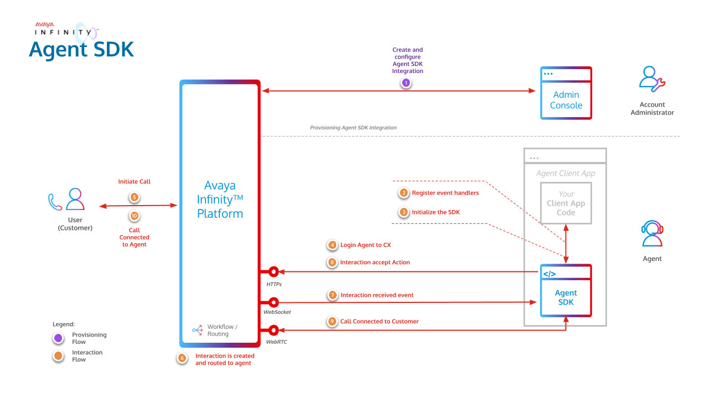

# Avaya Infinity™ Agent SDK

## Introduction
The Avaya Infinity™ platform provides the Agent SDK, which is a library that provides APIs designed to facilitate the seamless integration of Avaya Infinity™ contact center agent functionalities into the client application of your choice.

> ⚠️ Disclaimer
>
> Installing, downloading, copying or using this SDK is subject to terms and conditions available in the LICENSE file.

## Quick Start

To get started with the Agent SDK and quickly tryout the functionalities provided by it, Run the Demo Application. Refer the instructions in the [README](https://github.com/Avaya-Infinity/agent-sdk-web/tree/main/demo-app/README.md)

## Next Steps

1. Review the key components and integration flow involved to achieve Agent SDK integration in the [Overview](#overview) section.
2. Obtain the [necessary access information for Agent SDK](#details-required-for-agent-sdk-client) from the Avaya Infinity™ Admin Console.
3. Refer to these supporting artifacts:
	- [Agent SDK API documentation](https://avaya-infinity.github.io/agent-sdk-web/)
	- [Demo Client Application](./demo-app)
4. Integrate your client application with Agent SDK to enable contact center agent capabilities.

## Overview

Integration with Avaya Infinity™ Agent SDK requires the following steps at a high level:

1. [Provision an Agent SDK Integration](#provision-an-agent-sdk-integration)
2. Understand how to [Log in to Agent SDK through IdP](#logging-in-to-agent-sdk-through-idp).
3. Integrate your Client Application with Agent SDK to use Avaya Infinity™ contact center agent capabilities.

The below image gives a high level overview of the Agent SDK flow.

## Provision an Agent SDK Integration

Your Account Administrator must first [provision an Agent SDK integration](https://documentation.avaya.com/en-us/home/bundle/avaya-infinity/administeringavayainfinity/accounts/sdk-provisioning/configuring-an-sdk-integration.html) using the Avaya Infinity™ Admin Console. A unique client ID is generated for each integration, which is required for successfully authenticating your client application (which uses Agent SDK) with Avaya Infinity™.

Multiple integrations can be created in an Avaya Infinity™ account to represent various business functions. Each integration can be associated with multiple redirect URIs which allows for seamless SDK usage from multiple hosts.

### Details Required for Agent SDK Client

To integrate your client application with Avaya Infinity™ Agent SDK for contact center agent capabilities, you need to gather some essential details and credentials. Reach out to your Avaya Infinity™ account administrator to obtain the following.

1. Avaya Infinity™ hostname
2. Client ID
3. Redirect URI
4. Identity Provider (IdP) Hint (optional for SSO)

## Logging in to Agent SDK through IdP

The Agent SDK is also compatible with SSO based login which can be used via the Avaya Infinity™ Login page or directly via an Identity Provider (IdP) Hint.

Avaya Infinity™ Login page:

If you use the Avaya infinity login page, then the agent will need to provide the "Email" address configured during user creation. This will list the available IdP integrations on the login page. The agent can then click the desired IdP to proceed with the IdP login.

Providing the IdP hint during SDK initialization will redirect the agent to the IdP's login page, skipping the additional step mentioned above .i.e. entering the "Email" and choosing the IdP integration manually.

> [!NOTE]
>
> Same agent simultaneously logging into Agent Desktop and Agent SDK is not supported. 
> Multi-tab and Multi-browser is not supported in Agent SDK.

# Supported Browsers

The Agent SDK requires browsers that support at least ECMAScript 2022 or newer.

The Agent SDK has been tested and supported on following browsers:

- Chrome: Latest and one major version behind
- Edge: Latest and one major version behind

## License

View [LICENSE](https://support.avaya.com/css/public/documents/101038288)

## Changelog

View [CHANGELOG](./CHANGELOG.md)